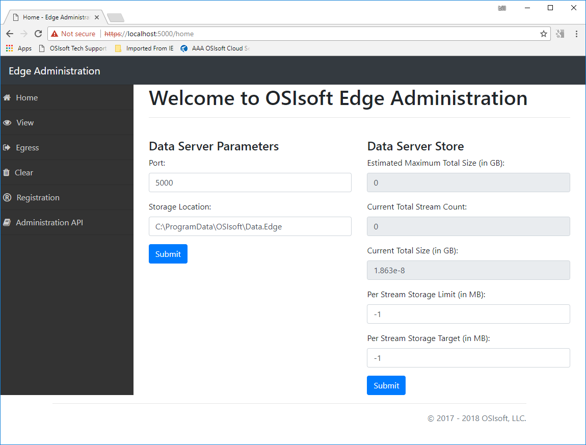

******************************
Edge Data Store Administration
******************************

.. contents:: Topics in this section: 

After running the installation program on the edge device, you can view the Edge administration pages using a browser.
The Edge Data Store administration web page is located here: 

``https://localhost:5000``

The administration web page resembles the following:

Home page
*********

The available options from the Home page are as follows:

Start Data Server
  The program is running but the Data Server inside the program can be started. 

Stop Data Server
  The program is running but the Data Server inside the program can be stopped.

Data Server Parameters
  You can change the Port address and the location of data storage. The default Port 5000; however, any available 
  port can be selected. In the *Storage Location* section, select any available storage location.
  Changing these settings requires stopping and restarting the Edge data server. See xxx for information.
  (This is a limitation of the CTP version.) 

Data Server Store
  The data server has two configurable settings:
  
  1. Per stream storage limit - Limits the amount of data (in megabytes) stored in each stream. 
     The data store automatically trims the oldest data first. The default value is "-1" which indicates unlimited. 
  2. Per stream storage target - Used to calculate the estimated maximum (?) size.  
  
  When finished making changes, click **Submit**.

View page
*********

The view tool is available to help end users confirm that data is stored in their Edge Data Store. You must select a
start and end time to return data. It might help to select a future end time so that current data is displayed.  

Any data present in the data store is displayed in the **Stream Data** window.

Egress page
***********

Edge Data Server supports two endpoints for data egress (exporting data); one endpoint is for sending data to a PI Connector 
Relay and one is for sending data to OSIsoft Cloud Services. 

Note
  You cannot send data to both a PI system and OSIsoft Cloud Services (OCS) at the same time. There are no options for 
  backfilling or for any type of historical data replay. 

In this version CTP1, if Egress is configured, as data flows into the data store it is immediately sent to the 
running Egress endpoint.  

PI Egress
  You can connect Edge Data Store to a PI Connector relay by inputing the Relay Endpoint Address and 
  providing its OMF Producer token. Click **Submit** to save your settings. 

  After your settings are saved, you must select **start PI Egress**. In CTP1, the Edge Data Store only sends simple 
  types to PI Connectors. The type must have a primary index of time stamp. 

  Note that memory and disk usage might rise considerably when using the data egress feature. See :ref:'Edge_Install_topic'

OCS Egress
  To send data to OCS you must obtain a cloud services account and configure cloud services to accept data. 
  Enter the Endpoint address for OCS and your producer token and select **Submit**. To finish, click **Start the OCS Egress**.  

Clear page
**********

The controls on this page are for deleting either the current stream data or to reset the entire configuration to its 
initial state - that is, the state of the data store immediately after software installation.

Purge Stream Event Data
  Use this option to delete any data contained in the stream. This option removes all of the values stored in the 
  streams in the Edge Data Store without purging the stream configuration. This function is helpful if the Data 
  store becomes corrupt and you simply want to return the Data Store to a state where it can collect data without 
  losing its configuration.
  
Reset configuration
  Use this option to return the Data store to a base configuration. The reset requires that the data server be stopped.
  Using this option removes all Egress settings and purges all the stream and stream configuration data from the data store. 

Registration page
*****************

For quality purposes, OSIsoft collects certain limited information about your Edge data store account. OSIsoft collects 
registration information and log data (such as exceptions and debugging information), while other data, such as 
QiTypes, QiStreams and Qi data, are not sent to OSIsoft and remains private.

Fill in the information on the Resistration page to register your information with OSIsoft. This informatin is required for
CTP.

Administration API page
***********************

The parameters on ths page show basic Edge Data Store API functions. The administration API is a Swagger document 
which helps developers understand what API endpoints are available and what the required parameters are. 

