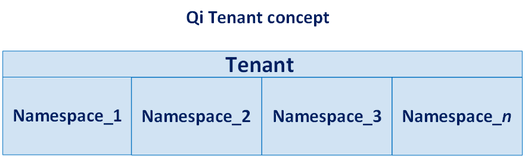

.. _Introducing_Edge DS_topic:

*************************
What is Edge Data Store?
*************************

.. contents:: Topics in this section:
    :depth: 3

Edge Data Store is a highly flexible sequential data store that you use to store, retrieve, and analyze data using *Edge* 
devices. An Edge device is a small-footprint, low-cost, Linux or Windows computer that can be located with or along side your 
remote assets. 

Edge devices loaded with Edge Data Store software use the OSIsoft Qi libraries to build a historian that can exist in 
a variety of diverse locations such as wind farms, mines, oil rigs, or even vehicles, where it is 
not possible or not practical to retrieve the data until it connects to a larger network or reaches a waypoint of some sort. 

You use the Edge device as a temporary data store until network connectivity is established, then use the data egress 
function to transfer the data to either an existing PI system or to OSIsoft Cloud Services (OCS). Edge systems  
differ from traditional OSIsoft interfaces or connectors becaue you can utilize the data directly from the Edge Data Store
using your own local applications.

To use an Edge Data Store, you use a simple REST (*REpresentational State Transfer*) API (*Application 
Programming Interface*) to create and write data to *streams*. The streams you create can be used to store 
simple or complex data types to suit 
your application needs. You can define simple or complex indexing to arrange and relate your data. An assortment 
of methods with customizable behaviors are available to read data and easily obtain needed information.

Samples
------------

The best way to get started with Edge Data Store is to run one or more of the code samples. Code samples are 
provided in a number of different programming languages to illustrate how to easily and effectively 
interact with Edge Data Store. The code samples are located in the Edge ``DS-Samples`` repository on GitHub. 

Each sample includes a readme which describes the steps required to run the sample and a brief description 
that highlights some of the sample’s functionality. Be sure to read the readme.rst file to understand 
how the sample works.

After you have finished this introduction and worked with one of the samples, refer to 
the :ref:`Quick_start_topic` section, which describes the interaction of 
various Edge Data Store objects and will help you get started creating your own applications.

Architecture
------------

A Tenant represents a logical separation of data in Edge Data Store. The Edge Data Store provides a default tenant 
named **default**. 

Tenants are divided into one or more logical units called *Namespaces*. Each Namespace is distinct and separate from 
other Namespaces; the Edge Data Store provides a default namespace named **data**. 

Getting help
------------

The following email address is available to participants of the Edge Data Store
Preview for both product support and to provide feedback to the Edge team:

`EdgeDSSupport@osisoft.com <mailto://EdgeDSSupport@osisoft.com>`__

To provide feedback about Edge Data Store please go to' <https://feedback.osisoft.com/forums/906877-edge>

The OSIsoft team will respond to all support requests as
quickly as possible during business hours (Pacific Time).

